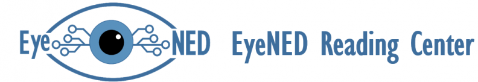
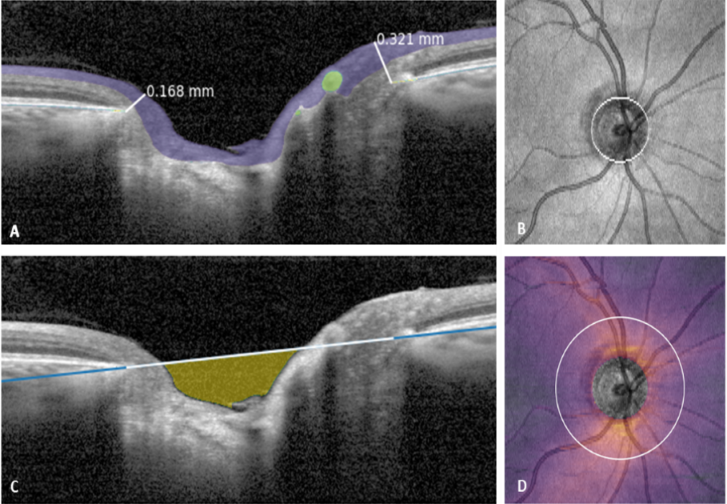

# EyeNED OCT-ONH: vendor-neutral analysis of optic nerve head OCT

This repository provides a vendor-neutral assessment of the anatomy of the optic nerve head, including the extraction of common features related to optic neuropathy, such as cpRNFL thickness and BMO-MRW. This method contains two steps:
1. A CNN-based segmentation of the ONH anatomy -- which was implemented in [nnUNetv2](https://github.com/MIC-DKFZ/nnUNet/). 
2. Comprehensive feature extraction, for both 3D cube or raster acquisitions and circular/radial scan patterns

The model was trained on the following devices and acquisition modes:
- Zeiss Cirrus HD-OCT 5000 -- 6x6mm cube (200x200)
- Heidelberg Spectralis -- circular and radial scans
- Topcon 3D OCT 2000 -- 6x6mm raster (128x512)

## Using our model

The model weights are stored at our [HuggingFace repository](https://huggingface.co/Eyened/OCT-ONH/tree/main).

If you use this code or our model for your research, please cite our manuscript:

S.J. Driessen et al. CNN-based device-agnostic feature extraction from ONH OCT scans, Translational Vision Science & Technology (Accepted, 2024) -- details will be added upon publication

Please feel free to post an issue if you run into them. Are you interested in the details or do you want to collaborate further? Please contact k.vangarderen \[at\] erasmusmc.nl

## Copyright notice

EyeNED OCT-ONH segmentation and feature extraction
Copyright (C) 2024  Erasmus MC

This program is free software: you can redistribute it and/or modify
it under the terms of the GNU Affero General Public License as published
by the Free Software Foundation, either version 3 of the License, or
(at your option) any later version.

This program is distributed in the hope that it will be useful,
but WITHOUT ANY WARRANTY; without even the implied warranty of
MERCHANTABILITY or FITNESS FOR A PARTICULAR PURPOSE.  See the
GNU Affero General Public License for more details.

You should have received a copy of the GNU Affero General Public License
along with this program.  If not, see <https://www.gnu.org/licenses/>.